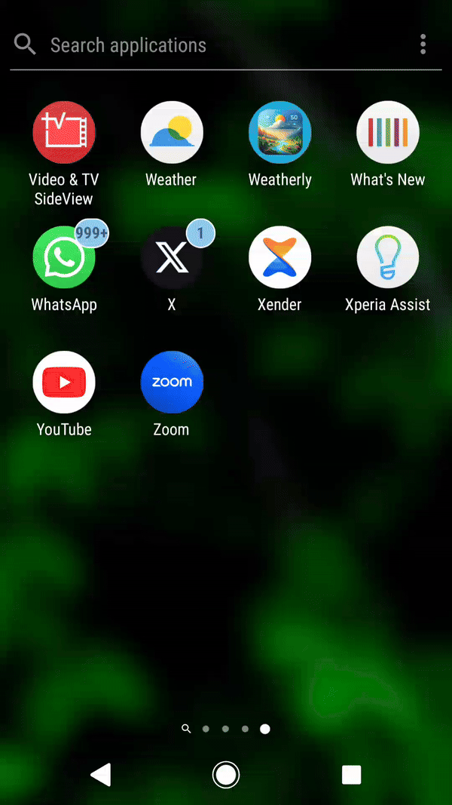

## Weatherly - Jetpack Compose Weather App (README)

Weatherly is an Android application built with Jetpack Compose and MVVM architecture that allows users to explore weather conditions for any location.

**Features:**

* **Location Search:** Search for weather data by city name.
* **Reverse Geocoding:** Get location name from latitude and longitude using Open-Meteo-API.
* **Weather Data:** Fetch real-time weather data using OpenWeatherMap API.
* **Local Caching:** Stores fetched weather data in a Room database to improve performance and reduce network usage.
* **Recent Searches:** View recently searched locations and their weather data.
* **Favorites:** Mark frequently accessed locations as favorites for quick access.

**Tech Stack:**

* Kotlin - Modern programming language for Android development.
* Jetpack Compose - Modern UI framework for building declarative and composable UIs.
* MVVM Architecture - Clean separation of concerns for maintainable code.
* Room - Persistence library for storing data in a local SQLite database.
* Open-Meteo-API - Free API for reverse geocoding (location name from coordinates).
* OpenWeatherMap API - Free API for weather data retrieval.

**Navigation:**

The app consists of three main screens:

* **Home:** Search for a location by name and view the current weather data.
* **Recents:** Displays a list of recently searched locations and their weather data.
* **Favorites:** Shows a list of user-marked favorite locations and their weather data.

**Getting Started:**

1. Clone this repository.
2. Ensure you have the necessary API keys for Open-Meteo-API and OpenWeatherMap.
3. Build and run the app on an Android device or emulator.

**Contributing:**

We welcome contributions to this project! Please see the CONTRIBUTING.md file for guidelines on how to contribute.

**License:**

This project is licensed under the Apache License 2.0. See the LICENSE file for details.
